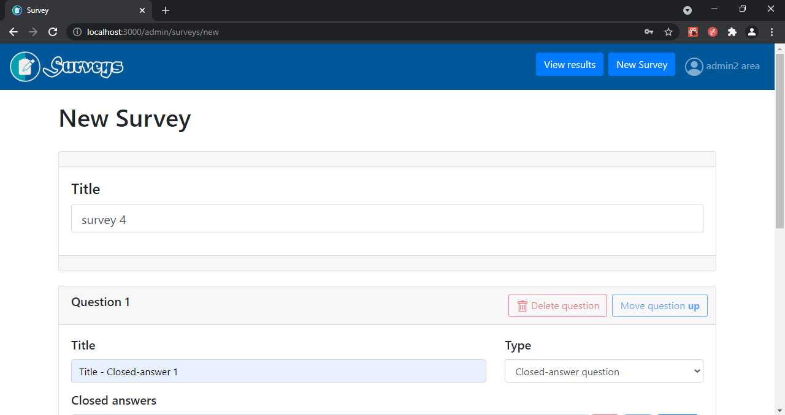
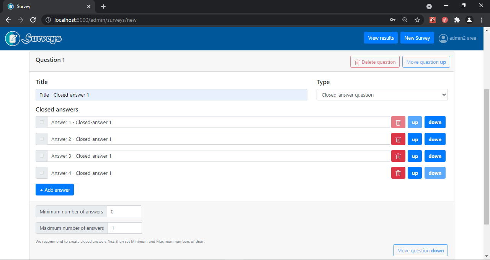
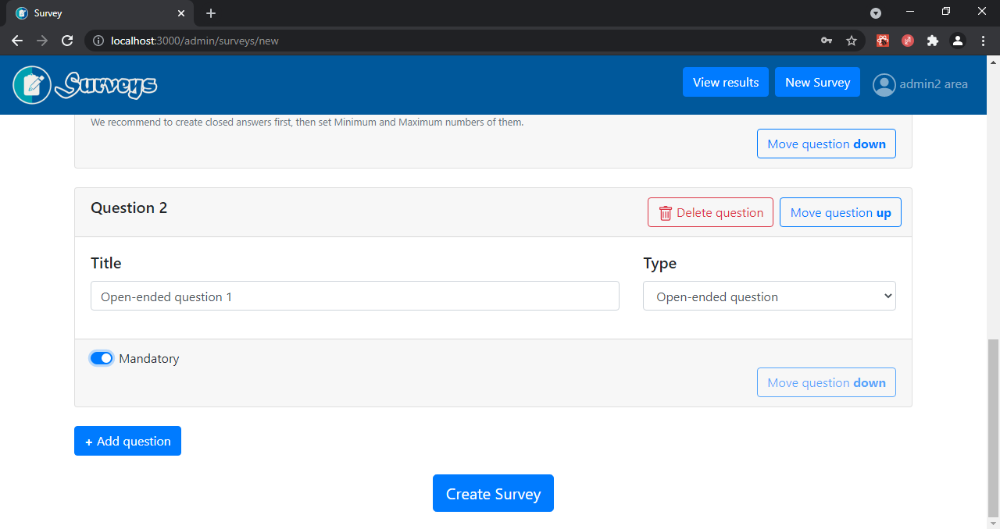

# Exam #1: "Survey"

## React Client Application Routes

- Route `/`:
  - if user: redirect to `/user/surveys`
  - if admin: redirect to `/admin/surveys`

- `USER` Routes:
  - Route `/user/surveys`: main page where a user may view and choose one of the published surveys 
  - Route `/user/surveys/survey`: page that allows to a user to respond to a choosen survey

- `ADMIN` Routes:
  - Route `/admin/surveys`: page that allows to an admin to view the list of surveys published by this administrator
  - Route `/admin/surveys/survey`: page that allows to an admin the creation of a new survey

## API Server
### ADMIN - Session APIs
- `POST`  URL: `api/sessions`
  - Description: Perform admin login
  - Request body: An object that contains credentials (username and password) of the admin
  - Request query parameter: _None_
  - Response: `200 OK` (success) or error
  - Response body: An object that contains admin information

- `DELETE`  URL: `api/sessions/current`
  - Description: Perform admin logout
  - Request body: _None_
  - Request query parameter: _None_
  - Response: `200 OK` (success) or error
  - Response body: possible error object

### ADMIN - Survey APIs

- `GET`  URL: `/api/:user/surveys/:sID`
  - Description: Retrieve a list of all the questions (with related answers) that fulfill a given survey id
  - Request body: _None_
  - Request query parameter: user that is 'admin' or 'user'; sID is the survey ID
  - Response: `200 OK` (success) or error
  - Response body: Array of objects, each describing one question

- `GET`  URL: `/api/admin/:adID/surveys`
  - Description: Retrieve a list of surveys that fulfill a given admin id (by listing their title and number of received responses)
  - Request body: _None_
  - Request query parameter: adID is the admin ID
  - Response: `200 OK` (success) or error
  - Response body: Array of objects, each describing one survey

- `GET`  URL: `/api/admin/surveys/:sID/users`
  - Description: Retrieve a list of users that fulfill a given survey id
  - Request body: _None_
  - Request query parameter: sID is the survey ID
  - Response: `200 OK` (success) or error
  - Response body: Array of objects, each describing one user

- `GET`  URL: `/api/:user/surveys/survey/questions/:qID/answers`
  - Description: Retrieve all answers related to a question id
  - Request body: _None_
  - Request query parameter: user that is 'admin' or 'user'; qID is the question ID
  - Response: `200 OK` (success) or error
  - Response body: Array of objects, each describing one answer related to the question

- `GET`  URL: `/api/admin/surveys/:sID/answers/:uID`
  - Description: Retrieve a list of answers related to a certain user and survey
  - Request body: _None_
  - Request query parameter: sID is the survey id; uID is the user ID
  - Response: `200 OK` (success) or error
  - Response body: Array of objects, each describing one answer related to the given user and survey

- `POST`  URL: `/api/admin/surveys/new`
  - Description: Create a new survey
  - Request body: a survey object that contains all its questions and if they are closed questions, each contains its own answers 
  - Request query parameter: _None_
  - Response: `200 OK` (success) or error
  - Response body: message

- `POST`  URL: `/api/admin/surveys/survey`
  - Description: Insert a CLOSE-ended answer
  - Request body: an answer object
  - Request query parameter: _None_
  - Response: `200 OK` (success) or error
  - Response body: new answer id 

### USER - Survey APIs

- `GET`  URL: `/api/user/surveys`
  - Description: Retrieve the list of all the available surveys
  - Request body: _None_
  - Request query parameter: _None_
  - Response: `200 OK` (success) or error
  - Response body: Array of objects, each describing one survey

- `POST`  URL: `/api/user/surveys`
  - Description: Create a new User
  - Request body: an object containing the name of the user
  - Request query parameter: _None_
  - Response: `200 OK` (success) or error
  - Response body: new user id 

- `POST`  URL: `/api/user/surveys/survey/answers/closed`
  - Description: Insert all answers related to a given CLOSED-answer
  - Request query parameter: an object containing the user ID and the question with all the related answers
  - Response: `200 OK` (success) or error
  - Response body: message

- `POST`  URL: `/api/user/surveys/survey/answers/closed`
  - Description: Insert a OPEN-ended answer
  - Request query parameter: an answer object
  - Response: `200 OK` (success) or error
  - Response body: message

## Database Tables

- Table `survey` - contains sID, title, adID
- Table `question` - contains qID, title, type, min, max, sID
- Table `admin` - contains adID, username, phash
- Table `answer` - contains anID, text, qID
- Table `user` - contains uID, name
- Table `user_answer` - contains uID, anID, each row represents a relation between the user and its answer

## Main React Components

- `NavigationBar` (in `App.js`): allows navigation and login/logout for administrators

- Main `USER` components:
  - `Surveys` (in `App.js`): allows to a user to retrieve all published surveys, click on them and insert its name with a Modal.
   
  Structure of `Surveys.js` summarized with its child components:
    - `Title`
    - `SurveyList`
      - `SurveyRow` : component that contains the Modal used for user name submission

  - `SurveyCompilation` (in `App.js`): allows to a user to fill out a choosen survey
     
    Structure of `SurveyCompilation.js` summarized with its child components:
    - `Title`
    - `Form`: components that wraps all questions and user answers in it, to permit a unique submit action
      - `QuestionCard`: component that directs all questions of a survey to each the exact question type
        - `ClosedAnswer`
        - `OpenAnswer`
    - `Button`: submit button for sending user answers to the survey
                  
- Main `ADMIN` components:
  - `AdminSurveys` (in `App.js`): allows to an admin to retrieve all its published surveys, click on them and view the results related to it
     
    Structure of `AdminSurveys.js` summarized with its child components: (similar to `Surveys.js` of the user)
    - `Title`
    - `SurveyList`
      - `SurveyRow`: component that allws redirect to a survey results visualization
  
  - `SurveyVisualization` (in `App.js`): allows to an admin to view results of a choosen survey
     
    Structure of `SurveyVisualization.js` summarized with its child components:
      - similar to `SurveyCompilation.js`, but in addition there is a comonent: `UserPagination` that permits to navigate through the answers given by the users.
  - `SurveyCreation` (in `App.js`): allows to an admin to create a new survey
       
    Structure of `SurveyCreation.js` summarized with its child components:
    - `Title`
    - `Form`
      - `TitleCard`
      - `QuestionCard`: component that directs the creation of each question to the exact question type 
    - `Button`: submit button for sending the new survey to the server

## Screenshot

## Users Credentials

| Username | Password       |
|----------|----------------|
| admin1   | firstPassword  |
| admin2   | secondPassword |

### Admin : admin1
|Survey|Number of compilations|
|------|:--------:|
|survey 1|2|
|survey 3|1|

### Admin : admin2
|Survey|Number of compilations|
|------|:--------:|
|survey 2|2|
|survey 4|0|
